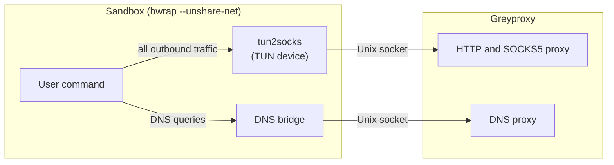
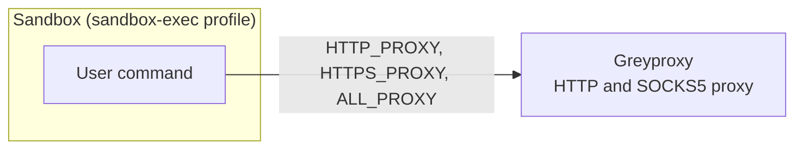

# Architecture

Greywall wraps commands with three boundaries: command blocking (deny and allow lists applied before execution), filesystem restriction, and network delegation to an external proxy. By default that proxy is [Greyproxy](/greyproxy), and every decision about which hosts or conversations are allowed lives there. Greywall itself never looks at a destination address.

The command and filesystem boundaries work the same way on both platforms. The network boundary is where Linux and macOS diverge, so each platform gets its own picture below.

For the threat model and what each boundary is meant to stop, see [Security Model](./security-model). For the kernel features used to tighten the Linux sandbox, see [Linux Security Features](./linux-security-features).

## Linux

On Linux, greywall runs the sandboxed command under `bubblewrap` with `--unshare-net`, so the sandbox has its own isolated network namespace. Nothing inside can reach the host network directly, and nothing outside can reach the sandbox except through channels greywall explicitly sets up.

Outbound traffic goes through a TUN device placed inside the namespace. `tun2socks` reads every packet from that device and forwards it across a Unix-socket bridge to greyproxy's HTTP and SOCKS5 proxy on the host. The capture is transparent, so it works even for applications that ignore proxy environment variables (Node.js's built-in `http`/`https`, for example).

DNS takes the same route. A DNS bridge inside the namespace forwards queries across a Unix-socket boundary to greyproxy's DNS proxy, so name resolution runs through the same filtered path as the rest of the traffic.

If the TUN device is unavailable (for example in a container that does not expose `/dev/net/tun`), greywall falls back to setting `HTTP_PROXY`, `HTTPS_PROXY`, and `ALL_PROXY` inside the namespace. In that mode only applications that honor those variables are routed; the rest are blocked by the namespace isolation rather than silently escaping.

## macOS

On macOS there is no TUN device and no DNS bridge. The sandbox runs under `sandbox-exec` with a generated Seatbelt profile that denies every outbound network connection by default. The profile adds a single exception: connections to greyproxy's HTTP and SOCKS5 ports on `localhost`. Everything else is refused at the sandbox layer.

Greywall also sets `HTTP_PROXY`, `HTTPS_PROXY`, and `ALL_PROXY` in the sandboxed process's environment so that applications which honor those variables route through greyproxy. Applications that ignore them do not silently escape, they hit the Seatbelt denial.

Because there is no transparent capture on macOS, the network guarantee is weaker than on Linux for any application that ignores proxy environment variables. That application will not reach the network (Seatbelt still denies it), but it will also not reach greyproxy, so it simply fails to connect. This is intentional: silent bypass is worse than a hard failure.

For a side-by-side feature table covering sandboxing, network capture, DNS, credential substitution, and learning-mode tracers, see [Platform Support](./platform-support). For the kernel features that sit under the Linux sandbox, see [Linux Security Features](./linux-security-features).
